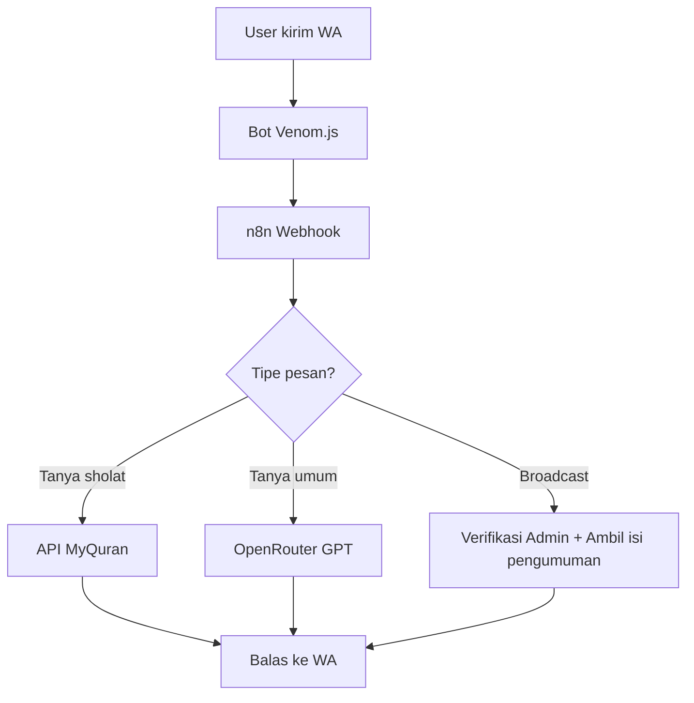

# 🕌 Masjid AI Agent

Agent AI otomatis untuk masjid yang dapat menjawab pertanyaan jamaah lewat WhatsApp, memberikan info jadwal sholat real-time, menyampaikan pengumuman dari pengurus, dan dapat diperluas ke feedback serta knowledge base.

## 🎯 Fitur Utama

- **🤖 WhatsApp Bot**: Otomatis menjawab pertanyaan jamaah via WhatsApp
- **🕌 Jadwal Sholat**: Info jadwal sholat real-time berdasarkan lokasi
- **📢 Pengumuman**: Sistem broadcast pengumuman dari pengurus masjid
- **🧠 AI Chat**: Menjawab pertanyaan umum seputar Islam dan kegiatan masjid
- **👨‍💼 Admin Panel**: Command khusus untuk pengurus masjid
- **🔧 Self-hosted**: Semua komponen dapat di-host sendiri secara gratis

## 🔧 Stack Teknologi

| Komponen | Tools | Status |
|----------|-------|--------|
| WhatsApp Bot | Venom.js (self-host) | ✅ Gratis |
| Workflow Otomasi | n8n.io (Docker + Railway) | ✅ Gratis |
| AI Chat | OpenRouter + model gratis | ✅ Gratis |
| Jadwal Sholat | API MyQuran | ✅ Gratis |
| Database ringan | Google Sheets (via API) | ✅ Gratis |
| Hosting Workflow | Railway.app | ✅ Gratis |

## 📁 Struktur Proyek

```
/masjid-ai-agent
│
├── /n8n
│   ├── workflows/
│   │   └── wa_ai_agent_flow.json    # Workflow n8n utama
│   └── Dockerfile                   # Docker config untuk n8n
│
├── /wa-bot
│   ├── venom.js                     # WhatsApp bot handler
│   └── webhook.js                   # Webhook handler
│
├── /scripts
│   ├── setup-local.sh              # Setup development lokal
│   └── deploy-railway.sh           # Deploy ke Railway
│
├── .env.example                     # Template environment variables
├── package.json                     # Dependencies Node.js
├── docker-compose.yml              # Docker compose untuk development
├── Dockerfile.wa-bot               # Docker config untuk WhatsApp bot
├── railway.json                    # Konfigurasi Railway
└── README.md                       # Dokumentasi ini
```

## 🚀 Quick Start

### 1. Setup Lokal

```bash
# Clone repository
git clone <repository-url>
cd masjid-ai-agent

# Jalankan setup script
./scripts/setup-local.sh

# Edit konfigurasi
cp .env.example .env
nano .env  # Sesuaikan dengan konfigurasi Anda
```

### 2. Konfigurasi Environment Variables

Edit file `.env` dengan konfigurasi Anda:

```env
# WhatsApp Bot Configuration
WA_SESSION_NAME=masjid-session

# n8n Webhook Configuration  
N8N_WEBHOOK_URL=https://your-n8n-railway.up.railway.app/webhook/wa

# OpenRouter AI Configuration
OPENROUTER_API_KEY=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
OPENROUTER_MODEL=z-ai/glm-4.5-air:free

# Default City for Prayer Times
DEFAULT_CITY=Jakarta
DEFAULT_CITY_ID=1301

# Admin WhatsApp Numbers (comma separated)
ADMIN_NUMBERS=628123456789,628987654321
```

### 3. Jalankan Development

```bash
# Opsi A: Menggunakan Docker
docker-compose up

# Opsi B: Jalankan manual
# Terminal 1 - n8n
npx n8n start

# Terminal 2 - WhatsApp Bot  
npm run dev
```

### 4. Import Workflow n8n

1. Buka n8n di `http://localhost:5678`
2. Import file `n8n/workflows/wa_ai_agent_flow.json`
3. Aktivasi workflow
4. Test webhook endpoint

### 5. Deploy ke Production

```bash
# Deploy ke Railway
./scripts/deploy-railway.sh
```

## 🔗 API yang Digunakan

### 🕌 Jadwal Sholat (API Aladhan + MyQuran)

**Primary API (Aladhan):**
```
GET https://api.aladhan.com/v1/timingsByCity?city={city}&country=ID&method=2
```

**Fallback API (MyQuran v2):**
```
GET https://api.myquran.com/v2/sholat/jadwal/{id_kota}/{tahun}/{bulan}/{tanggal}
```

### 🤖 AI dari OpenRouter

**Endpoint:**
```
POST https://openrouter.ai/api/v1/chat/completions
Authorization: Bearer YOUR_API_KEY
```

**Model yang Digunakan:**
- `z-ai/glm-4.5-air:free` (Model gratis dengan performa baik)

### 📊 Google Sheets Integration (Native API)

**Native API dengan Service Account:**
- Menggunakan `google-spreadsheet` library
- Service Account authentication
- Auto sheet creation dan management
- Better error handling dan security

**Sheets yang Digunakan:**
- `MessageLog` - Log semua pesan
- `FAQ` - Knowledge base FAQ  
- `PrayerLog` - Log permintaan jadwal sholat
- `AdminLog` - Log aktivitas admin
- `Announcements` - Template pengumuman

## 🔄 Alur Sistem



## 💬 Cara Penggunaan

### Untuk Jamaah:

**Jadwal Sholat:**
```
jadwal sholat
jadwal sholat jakarta
sholat maghrib hari ini
```

**Pertanyaan Umum:**
```
Apa itu puasa sunnah?
Kegiatan masjid apa saja minggu ini?
Bagaimana cara berwudhu yang benar?
```

### Untuk Admin:

**Kirim Pengumuman:**
```
/broadcast Sholat Jumat akan dimulai pukul 12:00 WIB
broadcast: Kajian rutin setiap Rabu malam
```

**Cek Status Bot:**
```
/status
/stats
```

## 🛠️ Development

### Menambah Fitur Baru

1. **Modifikasi n8n Workflow:**
   - Edit `n8n/workflows/wa_ai_agent_flow.json`
   - Tambah node baru untuk fitur
   - Test di n8n editor

2. **Update WhatsApp Bot:**
   - Edit `wa-bot/venom.js` untuk handler baru
   - Tambah endpoint di `wa-bot/webhook.js`

3. **Testing:**
   ```bash
   npm run dev
   # Test dengan mengirim pesan ke bot
   ```

### Struktur n8n Workflow

1. **Webhook Node** - Terima pesan dari WhatsApp
2. **Message Analyzer** - Analisis jenis pesan
3. **Switch Node** - Route berdasarkan jenis
4. **API Nodes** - Panggil API eksternal
5. **Function Nodes** - Logic processing
6. **Response Node** - Kirim balasan

## 🚀 Deployment

### Railway Deployment

1. **Install Railway CLI:**
   ```bash
   npm install -g @railway/cli
   railway login
   ```

2. **Deploy:**
   ```bash
   ./scripts/deploy-railway.sh
   ```

3. **Set Environment Variables:**
   - Buka Railway Dashboard
   - Set semua environment variables
   - Restart service

### Manual Deployment

1. **n8n Service:**
   ```bash
   docker build -t masjid-n8n ./n8n
   docker run -p 5678:5678 masjid-n8n
   ```

2. **WhatsApp Bot:**
   ```bash
   docker build -t masjid-wa-bot -f Dockerfile.wa-bot .
   docker run -p 3000:3000 masjid-wa-bot
   ```

## 🔧 Troubleshooting

### WhatsApp Bot Issues

**QR Code tidak muncul:**
```bash
# Hapus session lama
rm -rf sessions/
npm start
```

**Bot tidak merespon:**
- Cek koneksi internet
- Pastikan webhook URL benar
- Cek logs n8n workflow

### n8n Workflow Issues

**Workflow tidak aktif:**
- Pastikan workflow di-activate
- Cek environment variables
- Test webhook manual

**API Error:**
- Cek API key OpenRouter
- Pastikan quota belum habis
- Test API endpoint manual

### Deployment Issues

**Railway deployment gagal:**
- Cek environment variables
- Pastikan Docker build berhasil
- Lihat deployment logs

## 📈 Pengembangan Selanjutnya

### Fase 2: Knowledge Base
- ✍️ Form Google Sheets untuk update pengetahuan masjid
- 📊 Dashboard admin untuk manage content
- 🔍 Search engine untuk FAQ masjid

### Fase 3: Automation
- 🔁 Broadcast otomatis menjelang waktu sholat
- 📅 Reminder kegiatan masjid
- 📈 Analytics penggunaan bot

### Fase 4: Integration
- 🔒 Autentikasi admin via WhatsApp
- 💾 Database logging semua interaksi
- 📱 Mobile app untuk admin

## 🤝 Contributing

1. Fork repository
2. Create feature branch
3. Commit changes
4. Push to branch
5. Create Pull Request

## 📄 License

MIT License - Lihat file `LICENSE` untuk detail lengkap.

## 🆘 Support

- **Issues**: Buat issue di GitHub repository
- **Documentation**: Cek wiki untuk panduan detail
- **Community**: Join diskusi di GitHub Discussions

## 🙏 Acknowledgments

- **Venom.js** - WhatsApp Web API
- **n8n.io** - Workflow automation
- **OpenRouter** - AI API gateway
- **MyQuran API** - Prayer times data
- **Railway** - Hosting platform

---

**📱 Dibuat dengan ❤️ untuk jamaah masjid di seluruh Indonesia**

*Semoga bermanfaat untuk kemudahan ibadah dan dakwah digital* 🤲